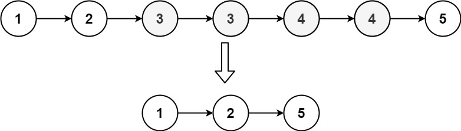

[](https://leetcode.com/problems/remove-duplicates-from-sorted-list-ii/)


---

# 82. Remove Duplicates from Sorted List II

Given the `head` of a sorted linked list, delete all nodes that have duplicate numbers, leaving only distinct numbers from the original list. Return the linked list **sorted** as well.

### Example 1:



```
Input: head = [1,2,3,3,4,4,5]
Output: [1,2,5]
```

### Example 2:


```
Input: head = [1,1,1,2,3]
Output: [2,3]
```

### Constraints:

- The number of nodes in the list is in the range `[0, 300]`.
- `-100 <= Node.val <= 100`
- The list is guaranteed to be **sorted** in ascending order.

### Related Topics

- Linked List
- Two Pointers
  
---

# 解題方向

Linked List 系列的 Two Pointers 暖身題，注意只要發現重複的節點時是**一個都不要**

剩下的就直接看程式碼吧