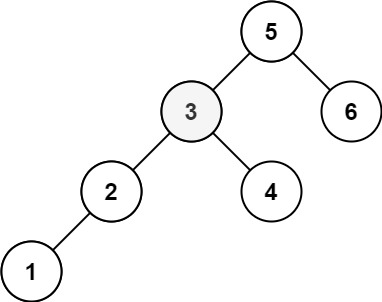

[](https://leetcode.com/problems/kth-smallest-element-in-a-bst/)


---

# 230. Kth Smallest Element in a BST

Given the `root` of a binary search tree, and an integer `k`, return the $\text{k}^\text{th}$ smallest value (**1-indexed**) of all the values of the nodes in the tree.

### Example 1:


```
Input: root = [3,1,4,null,2], k = 1
Output: 1
```

### Example 2:



```
Input: root = [5,3,6,2,4,null,null,1], k = 3
Output: 3
```

### Constraints:

- The number of nodes in the tree is `n`.
- 1 <= k <= n <= $10^4$
- 0 <= Node.val <= $10^4$

#### Follow up: 

If the BST is modified often (i.e., we can do insert and delete operations) and you need to find the kth smallest frequently, how would you optimize?

### Related Topics

- Tree
- Depth-First Search
- Binary Search Tree
- Binary Tree
  
---

# 解題方向

一種是用 inorder traversal 將整顆樹遍歷後輸出第 `k` 筆的資料

另一種就是單純從 left subtree 開始的 DFS，持續累計尋訪資料直到找到第 `k` 筆資料後停止