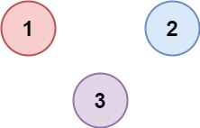

[](https://leetcode.com/problems/number-of-provinces/)


---

# 547. Number of Provinces

There are `n` cities. Some of them are connected, while some are not. If city `a` is connected directly with city `b`, and city `b` is connected directly with city `c`, then city `a` is connected indirectly with city `c`.

A **province** is a group of directly or indirectly connected cities and no other cities outside of the group.

You are given an `n x n` matrix `isConnected` where `isConnected[i][j] = 1` if the $i^{th}$ city and the $j^{th}$ city are directly connected, and `isConnected[i][j] = 0` otherwise.

Return the total number of **provinces**.

### Example 1:


```
Input: isConnected = [[1,1,0],[1,1,0],[0,0,1]]
Output: 2
```

### Example 2:



```
Input: isConnected = [[1,0,0],[0,1,0],[0,0,1]]
Output: 3
```

### Constraints:

- `1 <= n <= 200`
- `n == isConnected.length`
- `n == isConnected[i].length`
- `isConnected[i][j]` is `1` or `0`.
- `isConnected[i][i] == 1`
- `isConnected[i][j] == isConnected[j][i]`

### Related Topics

- Depth-First Search
- Breadth-First Search
- Union Find
- Graph
  
---

# 解題方向

### Solved using Union Find concept
