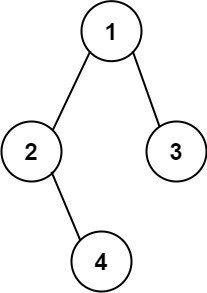

[](https://leetcode.com/problems/construct-string-from-binary-tree/)


---

# 606. Construct String from Binary Tree

Given the `root` of a binary tree, construct a string consisting of parenthesis and integers from a binary tree with the preorder traversal way, and return it.

Omit all the empty parenthesis pairs that do not affect the one-to-one mapping relationship between the string and the original binary tree.

### Example 1:


```
Input: root = [1,2,3,4]
Output: "1(2(4))(3)"

Explanation:
 - Originally, it needs to be "1(2(4)())(3()())", but you need to omit all the unnecessary empty parenthesis pairs. And it will be "1(2(4))(3)"
```

### Example 2:



```
Input: root = [1,2,3,null,4]
Output: "1(2()(4))(3)"

Explanation:
 - Almost the same as the first example, except we cannot omit the first parenthesis pair to break the one-to-one mapping relationship between the input and the output.
```

### Constraints:

- The number of nodes in the tree is in the range [1, $10^4$].
- `-1000 <= Node.val <= 1000`

### Related Topics

- String
- Tree
- Depth-First Search
- Binary Tree
  
---

# 解題方向

postorder traversal 暖身題，根據題目的 `pattern: root(left substree)(right subtree)` 將遍歷結果組合起來即可