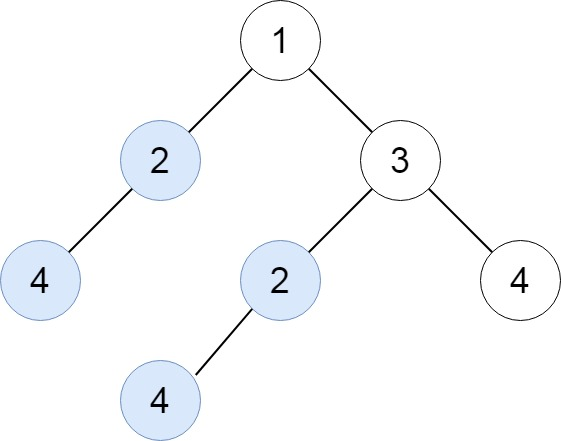

[](https://leetcode.com/problems/find-duplicate-subtrees/)


---

# 652. Find Duplicate Subtrees

Given the `root` of a binary tree, return all **duplicate subtrees**.

For each kind of duplicate subtrees, you only need to return the root node of any **one** of them.

Two trees are **duplicate** if they have the **same structure** with the **same node values**.

### Example 1:



```
Input: root = [1,2,3,4,null,2,4,null,null,4]
Output: [[2,4],[4]]
```

### Example 2:


```
Input: root = [2,1,1]
Output: [[1]]
```

### Example 3:


```
Input: root = [2,2,2,3,null,3,null]
Output: [[2,3],[3]]
```

### Constraints:

- The number of the nodes in the tree will be in the range [1, 10^4]
- `-200 <= Node.val <= 200`

### Related Topics

- Hash Table
- Tree
- Depth-First Search
- Binary Tree
  
---

# 解題方向

透過 Depth-First 的思路依序尋訪所有的子節點，並將尋訪結果加進 `Hash Table` 後檢查是否有相同的 `sub-tree`

- 注意過程中可能會出現多次重複的 `sub-tree`，留意不要重複累加即可