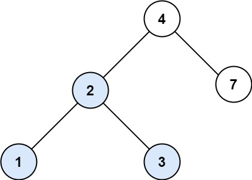

[](https://leetcode.com/problems/search-in-a-binary-search-tree/)


---

# 700. Search in a Binary Search Tree

You are given the `root` of a binary search tree (BST) and an integer `val`.

Find the node in the BST that the node's value equals `val` and return the subtree rooted with that node. If such a node does not exist, return `null`.

### Example 1:



```
Input: root = [4,2,7,1,3], val = 2
Output: [2,1,3]
```

### Example 2:


```
Input: root = [4,2,7,1,3], val = 5
Output: []
```

### Constraints:

- The number of nodes in the tree is in the range `[1, 5000]`.
- 1 <= Node.val <= $10^7$
- `root` is a binary search tree.
- 1 <= val <= $10^7$

### Related Topics

- Tree 
- Binary Search Tree 
- Binary Tree  

---

# 解題方向

基本的 BST 查找問題
