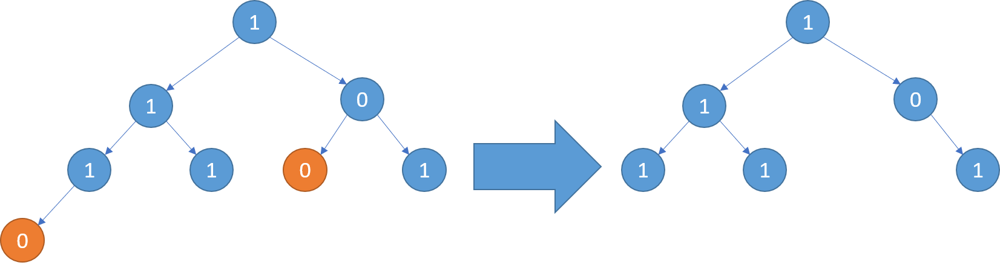

[](https://leetcode.com/problems/binary-tree-pruning/)


---

# 814. Binary Tree Pruning

Given the `root` of a binary tree, return the same tree where every subtree (of the given tree) not containing a `1` has been removed.

A subtree of a node `node` is `node` plus every node that is a descendant of `node`.

### Example 1:


```
Input: root = [1,null,0,0,1]
Output: [1,null,0,null,1]

Explanation: 
 - Only the red nodes satisfy the property "every subtree not containing a 1".
 - The diagram on the right represents the answer.
```

### Example 2:


```
Input: root = [1,0,1,0,0,0,1]
Output: [1,null,1,null,1]
```

### Example 3:



```
Input: root = [1,1,0,1,1,0,1,0]
Output: [1,1,0,1,1,null,1]
```

### Constraints:

- The number of nodes in the tree is in the range `[1, 200]`.
- `Node.val` is either `0` or `1`.

### Related Topics

- Tree
- Depth-First Search
- Binary Tree
  
---

# 解題方向

`DFS` 暖身題，用 postorder traversal 的觀念處理即可