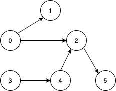
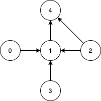

[](https://leetcode.com/problems/minimum-number-of-vertices-to-reach-all-nodes/)


---

# 1557. Minimum Number of Vertices to Reach All Nodes

Given a **directed acyclic graph**, with `n` vertices numbered from `0` to `n-1`, and an array `edges` where edges[i] = [from~i~, to~i~] represents a directed edge from node from~i~ to node to~i~.

Find the smallest set of vertices from which all nodes in the graph are reachable. It's guaranteed that a unique solution exists.

Notice that you can return the vertices in any order.

### Example 1:



```
Input: n = 6, edges = [[0,1],[0,2],[2,5],[3,4],[4,2]]
Output: [0,3]

Explanation:
 - It's not possible to reach all the nodes from a single vertex. 
 - From 0 we can reach [0,1,2,5]. From 3 we can reach [3,4,2,5]. So we output [0,3].
```

### Example 2:



```
Input: n = 5, edges = [[0,1],[2,1],[3,1],[1,4],[2,4]]
Output: [0,2,3]

Explanation: 
 - Notice that vertices 0, 3 and 2 are not reachable from any other node, so we must include them. 
 - Also any of these vertices can reach nodes 1 and 4.
```

### Constraints:

- 2 <= n <= $10^5$
- 1 <= edges.length <= min($10^5$, n * (n - 1) / 2)
- `edges[i].length == 2`
- 0 <= from~i~, to~i~ < n
- All pairs (from~i~, to~i~) are distinct.

### Related Topics

- Graph
  
---

# 解題方向

本來以為很複雜，但說穿了只是要我們找出有哪些節點的 `indegree` 是 `0`