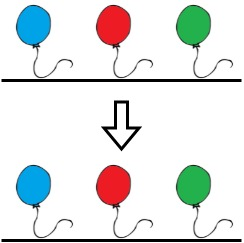

[](https://leetcode.com/problems/minimum-time-to-make-rope-colorful/)


---

# 1578. Minimum Time to Make Rope Colorful

Alice has `n` balloons arranged on a rope. You are given a **0-indexed** string `colors` where `colors[i]` is the color of the $i^{th}$ balloon.

Alice wants the rope to be **colorful**. She does not want **two consecutive balloons** to be of the same color, so she asks Bob for help. Bob can remove some balloons from the rope to make it **colorful**. You are given a **0-indexed** integer array `neededTime` where `neededTime[i]` is the time (in seconds) that Bob needs to remove the $i^{th}$ balloon from the rope.

Return the **minimum time** Bob needs to make the rope **colorful**.

### Example 1:


```
Input: colors = "abaac", neededTime = [1,2,3,4,5]
Output: 3

Explanation:
 - In the above image, 'a' is blue, 'b' is red, and 'c' is green.
 - Bob can remove the blue balloon at index 2. This takes 3 seconds.
 - There are no longer two consecutive balloons of the same color. Total time = 3.
```

### Example 2:



```
Input: colors = "abc", neededTime = [1,2,3]
Output: 0

Explanation:
 - The rope is already colorful. Bob does not need to remove any balloons from the rope.
```

### Example 3:


```
Input: colors = "aabaa", neededTime = [1,2,3,4,1]
Output: 2

Explanation:
 - Bob will remove the ballons at indices 0 and 4. Each ballon takes 1 second to remove.
 - There are no longer two consecutive balloons of the same color. Total time = 1 + 1 = 2.
```

### Constraints:

- `n == colors.length == neededTime.length`
- 1 <= `n` <= $10^5$
- 1 <= `neededTime[i]` <= $10^4$
- `colors` contains only lowercase English letters.

### Related Topics

- Array
- String
- Dynamic Programming
- Greedy
  
---

# 解題方向

從頭到尾遍歷一次 `colors`，過程中持續記錄本次遇到的氣球顏色與處理時間，一旦發現連續相同顏色出現時，就將處理時間較低的那顆處理掉，將較久的處理時間記錄下來準備下一次比較