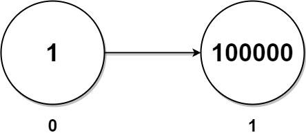

[](https://leetcode.com/problems/maximum-twin-sum-of-a-linked-list/description/)


---

# 2130. Maximum Twin Sum of a Linked List

In a linked list of size `n`, where `n` is even, the $i^{th}$ node (**0-indexed**) of the linked list is known as the twin of the ${(n-1-i)}^{th}$ node, if 0 <= i <= (n / 2) - 1.

- For example, if `n = 4`, then node `0` is the twin of node `3`, and node `1` is the twin of node `2`. These are the only nodes with twins for `n = 4`.

The twin sum is defined as the sum of a node and its twin.

Given the `head` of a linked list with even length, return the maximum twin sum of the linked list.

### Example 1:


```
Input: head = [5,4,2,1]
Output: 6

Explanation:
 - Nodes 0 and 1 are the twins of nodes 3 and 2, respectively. All have twin sum = 6.
 - There are no other nodes with twins in the linked list.
 - Thus, the maximum twin sum of the linked list is 6. 
```

### Example 2:


```
Input: head = [4,2,2,3]
Output: 7

Explanation:
 The nodes with twins present in this linked list are:
 - Node 0 is the twin of node 3 having a twin sum of 4 + 3 = 7.
 - Node 1 is the twin of node 2 having a twin sum of 2 + 2 = 4.
 Thus, the maximum twin sum of the linked list is max(7, 4) = 7. 
```

### Example 3:



```
Input: head = [1,100000]
Output: 100001

Explanation:
 - There is only one node with a twin in the linked list having twin sum of 1 + 100000 = 100001.
```

### Constraints:

- The number of nodes in the list is an even integer in the range [2, $10^5$].
- 1 <= Node.val <= $10^5$

### Related Topics

- Linked List
- Two Pointers
- Stack

---

# 解題方向

先用 Two Pointers 的觀念找到 Linked List 的中間位置後

接著有兩種不同的做法：

1. 用一個 array(stack) 記住 slow pointer 走訪過的 value，給走訪右半部時拿出來使用
2. slow pointer 開始反轉右半部的 linked list，在定義一個新的指針指著 head，左右往內夾
