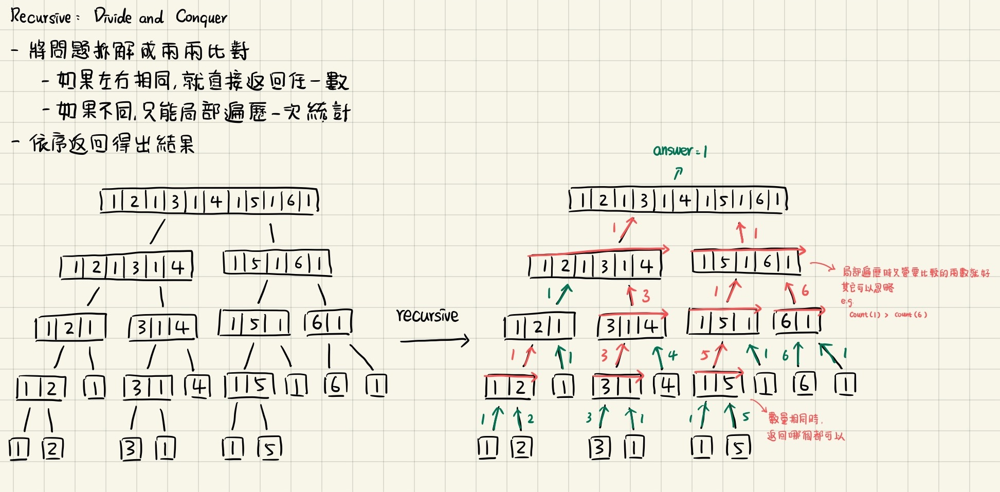
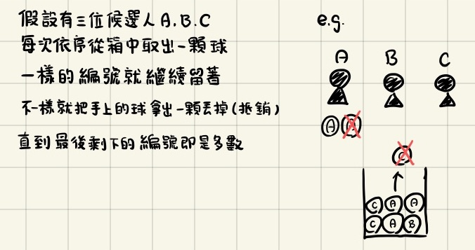

# `Easy` Majority Element

Given an array `nums` of size `n`, return the majority element.

The majority element is the element that appears more than `⌊n / 2⌋` times. You may assume that the majority element always exists in the array.

### Example 1:

```
Input: nums = [3,2,3]
Output: 3
```

### Example 2:

```
Input: nums = [2,2,1,1,1,2,2]
Output: 2
```

### Constraints:

- `n == nums.length`
- 1 <= n <= 5 * $10^4$
- -$10^9$ <= nums[i] <= $10^9$
 
#### Follow-up:

Could you solve the problem in linear time and in `O(1)` space?

### Related Topics:

- Array
- Hash Table
- Divide and Conquer
- Sorting
- Counting

---

# 解題方向

### Solved using data stucture

- 遍歷整個陣列一次，把所有數字用一個 Hash Map 計數
- 在對 Hash Map 遍歷一次，找出統計次數最高的那個數字

但這種做法不符合題目要求的 `O(1)` space

### Solved using Divide and Conquer Approach

不說了直接上圖



### Solved using Boyer-Moore Voting Algorithm

- 題目定義至少有一個數字的出現次數超過一半以上

還是上圖好了

