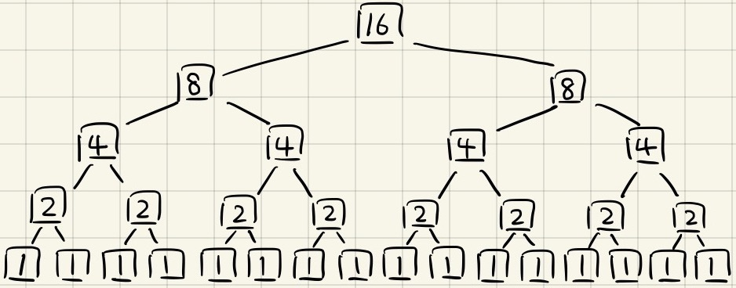
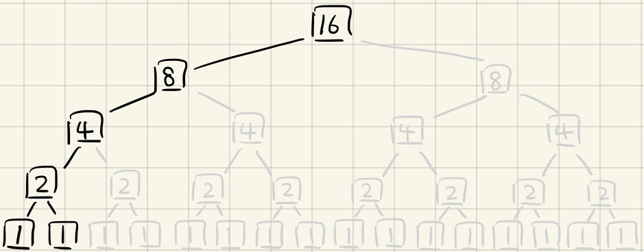
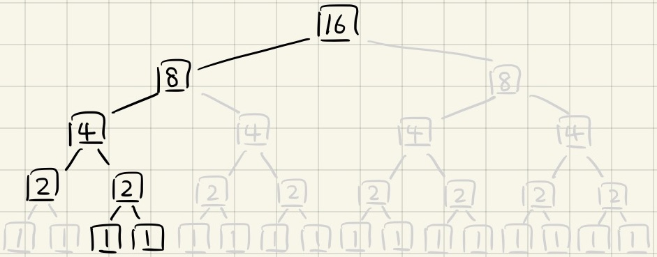
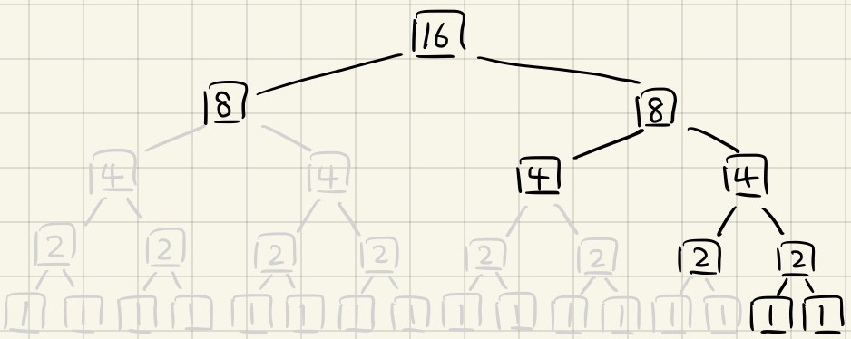

# `Easy` Contains Duplicate

Given an integer array `nums`, return `true` if any value appears **at least twice** in the array, and return `false` if every element is distinct.

### Example 1:

```
Input: nums = [1,2,3,1]
Output: true
```

### Example 2:

```
Input: nums = [1,2,3,4]
Output: false
```

### Example 3:

```
Input: nums = [1,1,1,3,3,4,3,2,4,2]
Output: true
```

### Constraints:

- 1 <= nums.length <= $10^5$
- -$10^9$ <= nums[i] <= $10^9$

### Related Topics:

- Array
- Hash Table
- Sorting

---

# 解題方向

### Solved using data structure

- Hash Map 結案

### Solved using merge sort algorithm

Wiki 的這張動畫做的很棒，讚嘆 Wiki


#### Top-down resursion

- Time Complexity : `O(nlogn)`，這應該不用多說
- Space Complexity : `O(n)`

在算空間複雜度的時候我遇到一個最大的困惑，就是為什麼不是 O(nlogn)？

如果我們畫出樹狀結構來看的話，乍看之下會很像是 O(nlogn) 沒錯



但如果實際以演算法來看，因為 recursion 是 depth first，所以並不會同時展開所有的分支，如下所示

 - 目前已使用空間 : `16 + 8 + 4 + 2 + 1 +1 = 32`



繼續往下一步來看，開始處理第一次的合併時

 - 使用空間 : `16 + 8 + 4 + 2 + 2 + 1 + 1 = 34`



一路下去，直到最後一步

 - 使用空間 : `16 + 8 + 8 + 4 + 4 + 2 + 2 + 1 + 1 = 46`



也就是說，最大的空間複雜度不會超過 `3n`，即 `O(3n)` -> `O(n)`
